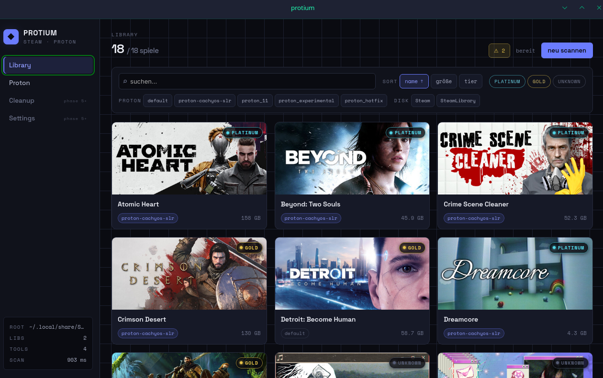
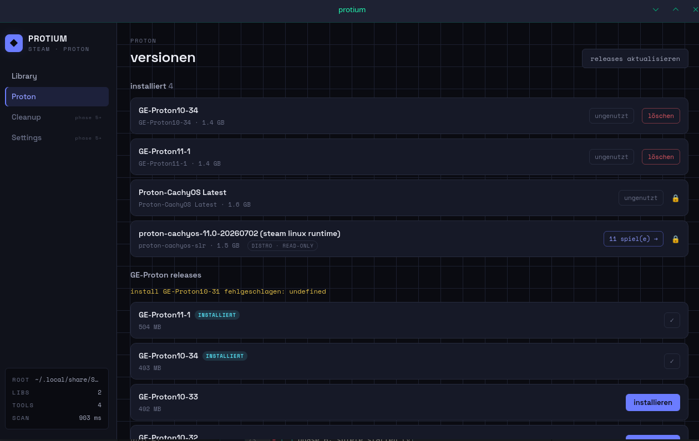

# protium

> ein proton. ein elektron. das simpelste atom im universum, und ungefähr so viel overhead soll auch dieses tool haben.

protium ist eine linux-desktop-app für steam/proton-housekeeping. sie zeigt dir, was auf deinem system wirklich los ist: welche spiele über welche proton-version laufen, wie die auf protondb bewertet sind, welche GE-proton-versionen ungenutzt platz fressen und (bald) welche verwaisten prefixes von längst deinstallierten spielen noch gigabytes belegen.

entstanden, weil es genau dieses tool nicht gab. protonup-qt managt nur versionen, protontricks ist ein winetricks-wrapper, steamtinkerlaunch kann alles und ist genau deshalb unübersichtlich. protium will die eine aufgeräumte oberfläche für den kompletten workflow sein.





## was es kann

**library-übersicht.** alle spiele über alle libraries (auch auf externen platten), mit cover, größe, zugewiesener proton-version und protondb-tier direkt auf der karte. cover kommen aus steams lokalem librarycache, die app funktioniert also auch komplett offline.

**GE-proton-manager.** installierte versionen mit größe und der info, welche spiele sie tatsächlich nutzen. neue releases direkt von github installieren (streaming-download mit sha512-prüfung), ungenutzte löschen. distro-protons wie proton-cachyos werden erkannt und als read-only markiert, die gehören dem paketmanager, nicht uns.

**ehrliche fehlerbehandlung.** nicht gemountete platten, kaputte manifeste, protondb offline: alles degradiert sauber zu warnings statt zu crashes. die app lügt dich nicht an und tut nichts, was sie nicht rückgängig machen kann.

geplant (siehe roadmap): compat-tool und launch-options direkt setzen, cleanup verwaister prefixes, spiele starten.

## warum kein bestehendes tool

kurz: sichtbarkeit ist das produkt. beim ersten scan auf dem eigenen entwicklungsrechner fanden sich 2,8 GB ungenutzte GE-versionen und drei spiele, die entgegen der eigenen annahme auf drei verschiedenen protons liefen. wenn das tool dem eigenen autor was neues über sein system erzählt, ist das ein gutes zeichen.

## stack

tauri v2 als shell, vue 3 + typescript für UI und domänenlogik, rust nur als dünne schicht für das, was die webview nicht kann (tarball-extraktion, streaming-downloads mit hash, prozess-checks). kein electron, das binary bleibt klein und nutzt die system-webview (webkit2gtk).

die domänenlogik in `src/core/` ist komplett UI-frei und redet mit dem system nur über ports/adapter. dadurch läuft die gesamte testsuite headless gegen fixtures, ohne tauri, ohne steam, ohne netz.

## dev-setup

voraussetzungen (cachyos/arch):

```sh
sudo pacman -S --needed webkit2gtk-4.1 base-devel curl wget file openssl librsvg
rustup default stable   # falls rust fehlt: sudo pacman -S rustup
```

dann:

```sh
npm install
npm test              # vitest, core headless gegen fixtures
npm run check         # biome
npm run tauri dev     # app starten (erster build kompiliert rust, dauert etwas)
```

cache liegt unter `~/.cache/com.protium.desktop/`.

## struktur

```
src/core/       domänenlogik, UI-frei. scanLibrary(ports) ist die einzige public api
src/core/adapters/tauri.ts   ports gegen plugin-fs/http + rust-commands
src/ui/         vue-app: library, proton-manager, views je phase
src-tauri/      rust-commands (extract, download, prozess-check, dir-size, fs-scope)
tests/          vitest gegen fake-steam-fixtures
```

grundregeln, die überall gelten: schreibende zugriffe auf steam-dateien laufen ausnahmslos durch ein write-gate (steam-läuft-check, backup, atomarer write). destruktive aktionen fragen immer nach und zeigen konkret, was passieren würde. netzwerkausfall darf features verarmen, aber nie die app blockieren.

## roadmap

- [x] phase 1: core data layer (scan, vdf-parsing, protondb, multi-library inkl. externer mounts)
- [x] phase 2: library-UI (cover-grid, tiers, warnings)
- [x] phase 3: GE-proton-manager (install/remove, queue, distro-tool-erkennung)
- [ ] phase 3 rest: laufende downloads abbrechen inkl. aufräumen
- [ ] phase 4: compat-tool und launch-options setzen (write-gate, backups, restore)
- [ ] phase 5: cleanup verwaister prefixes und shader-caches, AUR-paket
- [ ] phase 6: spiele starten (via steam-protokoll, kein eigener launcher)

## status

in aktiver entwicklung api und UI ändern sich ohne vorwarnung. wer das liest, bevor eine nahe endversion steht: die roadmap oben ist der ehrliche stand, nicht der wunschzettel.
