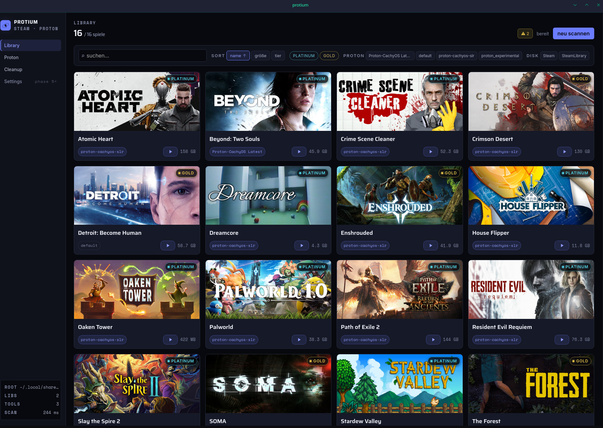
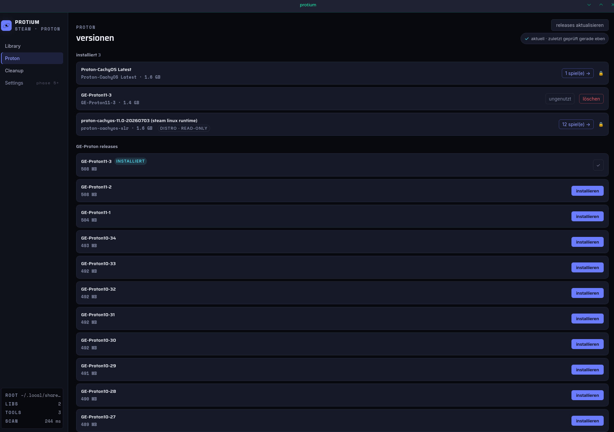
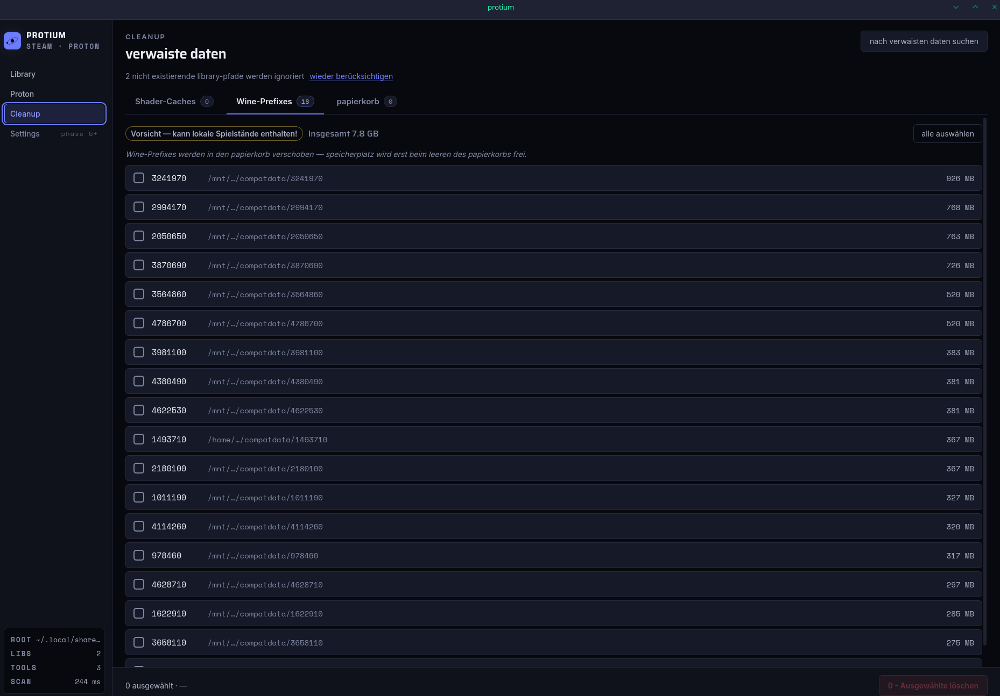

# protium

**deutsch** · [english](README.en.md)

[](https://github.com/Tzyber/Protium/actions/workflows/ci.yml)

> ein proton. ein elektron. das simpelste atom im universum, und ungefähr so viel overhead soll auch dieses tool haben.

> Claude Contributor: spirituell. Commits: nicht nachweisbar.

protium ist eine linux-desktop-app für steam/proton-housekeeping. sie zeigt dir, was auf deinem system wirklich los ist: welche spiele über welche proton-version laufen, wie die auf protondb bewertet sind, welche GE-proton-versionen ungenutzt platz fressen und welche verwaisten prefixes von längst deinstallierten spielen noch gigabytes belegen.

entstanden, weil es genau dieses tool nicht gab. protonup-qt managt nur versionen, protontricks ist ein winetricks-wrapper, steamtinkerlaunch kann alles und ist genau deshalb unübersichtlich. protium bündelt diese Aufgaben in einer Oberfläche.







## was es kann

**library-übersicht.** alle spiele über alle libraries (auch auf externen platten), mit cover, größe, zugewiesener proton-version und protondb-tier direkt auf der karte. cover kommen aus steams lokalem librarycache, die app funktioniert also auch komplett offline.

**GE-proton-manager.** installierte versionen mit größe und der info, welche spiele sie tatsächlich nutzen. neue releases direkt von github installieren (streaming-download mit sha512-prüfung, abbrechbar, mit aufräumen der partiellen datei), ungenutzte löschen. distro-protons wie proton-cachyos werden erkannt und als read-only markiert — die gehören dem paketmanager, nicht uns.

**compat-tool + launch-options.** proton-version und startoptionen pro spiel direkt setzen. write-gate (steam-läuft-check → backup → atomarer rename), und ein chirurgischer vdf-string-patch statt voll-serialisierung, weil steams escaping und schlüsselreihenfolge sonst nicht erhalten bleiben.

**cleanup.** verwaiste wine-prefixes und shader-caches finden und bereinigen, in drei getrennten bereichen: shader-caches, wine-prefixes, papierkorb. shader-caches werden hart gelöscht. prefixes werden innerhalb desselben dateisystems in den papierkorb verschoben. erst beim leeren wird speicherplatz freigegeben.

**fehlerfälle.** nicht verfügbare oder unlesbare Daten werden als solche angezeigt. Bei schreibenden und löschenden Aktionen fragt protium vorher nach und legt, wo möglich, einen Rückweg an.

**spiele starten.** via `steam://rungameid/<appId>` — kein eigener launcher, keine prozess-überwachung.

**bedienbarkeit.** vollständig mit der tastatur bedienbar, sichtbare focus-states, tabs nach WAI-ARIA-pattern (pfeiltasten, roving tabindex), kontraste auf WCAG-AA geprüft, `prefers-reduced-motion` global respektiert. schriftgrößen in `rem`, damit die app mit der system-schriftgröße mitwächst. oberfläche auf deutsch und englisch, key-parität durch einen test abgesichert.

### unterstützte steam-installationen

protium erkennt steam automatisch in diesen installationsarten:
- **nativ** — `~/.local/share/Steam` und `~/.steam/steam`
- **flatpak** — `~/.var/app/com.valvesoftware.Steam/.local/share/Steam`
- **symlinks und custom-pfade** — `discoverSteamRoot` löst symlinks via `realpath` auf

snap-unterstützung (`~/snap/steam/`) — ab 0.1.7 enthalten, aber nur gegen fixtures getestet, noch kein echtes snap-system verifiziert.

### prefix aus dem papierkorb zurückholen

protium hat bewusst **keine** wiederherstellungs-funktion: sobald ein spiel neu installiert ist, existiert `compatdata/<appId>` wieder, und ein automatisches zurückschieben müsste entscheiden, welcher stand gilt. dazu kommt, dass ein prefix von einer anderen proton-version stammen kann als die aktuell eingestellte. das sind entscheidungen für den menschen, nicht für ein tool.

von hand ist es ein `mv`. der papierkorb liegt in derselben library, der eintrag heisst `compatdata_<appId>_<zeitstempel>`:

```sh
cd /pfad/zur/SteamLibrary/steamapps
ls .protium-trash                       # eintrag finden
mv .protium-trash/compatdata_1477940_1785071505657 compatdata/1477940
```

wichtig: das ziel `compatdata/<appId>` darf nicht schon existieren. tut es das, hast du zwei stände — dann erst den vorhandenen wegsichern und danach entscheiden. steam legt einen fehlenden prefix beim nächsten spielstart selbst neu an (dann ohne die alten spielstände).

## warum kein bestehendes tool

der zweck ist, diese informationen an einer stelle sichtbar zu machen. der erste scan zeigte bereits unterschiede zwischen der erwarteten und der tatsächlich verwendeten proton-konfiguration.

## stack

tauri v2 als shell, vue 3 + typescript für UI und domänenlogik, rust nur für das, was die webview nicht darf. kein electron, das binary bleibt klein und nutzt die system-webview (webkit2gtk).

konkret übernimmt rust nur: unter 1000 produktive zeilen für pfad-validierung, streaming-downloads mit hash, tarball-extraktion, die beiden löschbefehle, prozess-check und fs-scope-freigabe. geschäftslogik und UI-entscheidungen liegen nicht in dieser schicht. dazu kommen fast doppelt so viele testzeilen wie produktivcode. diese pfade verändern oder löschen dateien und sind deshalb separat getestet.

die domänenlogik in `src/core/` ist komplett UI-frei und redet mit dem system nur über ports/adapter. dadurch läuft die gesamte core-testsuite headless gegen fixtures, ohne tauri, ohne steam, ohne netz.

## dev-setup

voraussetzungen (cachyos/arch):

```sh
sudo pacman -S --needed webkit2gtk-4.1 base-devel curl wget file openssl librsvg
rustup default stable   # falls rust fehlt: sudo pacman -S rustup
```

dann:

```sh
npm install
npm test              # vitest — core headless gegen fixtures
npm run check         # biome (194 lint-regeln, 0 warnings) + vue-tsc --noEmit
(cd src-tauri && cargo test)   # rust: download-pfade, pfad-validierung, tarball-extraktion, cleanup/papierkorb
npm run tauri dev     # app starten (erster build kompiliert rust, dauert etwas)
```

`npm run check`, `npm test` und die cargo-tests laufen zusätzlich in der CI bei jedem push und pull request. der tauri-build zum bundlen der app läuft dort bewusst nicht, er gehört zu phase 6.

cache liegt unter `~/.cache/com.protium.desktop/`.

### abhängigkeiten und advisories

```sh
(cd src-tauri && cargo audit)
```

`src-tauri/audit.toml` listet advisories, die bewusst getragen werden — jeweils per ID mit begründung, damit ein **neuer** advisory weiterhin anschlägt. betrifft im wesentlichen tauris GTK3-stack (die gtk-rs-bindings sind unmaintained, gtk-rs ist auf GTK4 umgezogen) und build-time-only-crates. wiedervorlage, sobald tauri auf gtk-rs 0.20 geht.

## struktur

```
src/core/       domänenlogik, UI-frei. redet nur über ports
src/core/adapters/tauri.ts   ports gegen plugin-fs/http + rust-commands
src/ui/         vue-app: library, proton-manager, cleanup, i18n (de/en)
src-tauri/      rust-commands (extract, download, prozess-check, dir-size, fs-scope, löschpfade)
tests/          vitest gegen fake-steam-fixtures
docs/           screenshots, smoke-checkliste
```

für die implementierung gelten folgende regeln: schreibende zugriffe auf steam-dateien laufen ausnahmslos durch ein write-gate (steam-läuft-check, backup, atomarer write). destruktive aktionen fragen immer nach und zeigen konkret, was passieren würde. wo pfadwissen gebraucht wird, kommt es aus `paths.ts` und nicht aus zusammengebauten strings. netzwerkausfall darf features verarmen, aber nie die app blockieren. kann ein wert nicht zuverlässig bestimmt werden, zeigt die app `unbekannt` an.

## roadmap

- [x] phase 1: core data layer (scan, vdf-parsing, protondb, multi-library inkl. externer mounts)
- [x] phase 2: library-UI (cover-grid, tiers, warnings, such/filter/sort)
- [x] phase 3: GE-proton-manager (install/remove, queue, distro-tool-erkennung, downloads abbrechen inkl. aufräumen)
- [x] game-detail-drawer mit protondb-link (reports anderer nutzer)
- [x] phase 4: compat-tool und launch-options setzen (write-gate, backups, vdf-string-patch)
- [x] phase 5: cleanup verwaister prefixes und shader-caches + papierkorb
- [x] spiele starten (via steam-protokoll, kein eigener launcher)
- [x] i18n (deutsch/englisch)
- [x] CI: lint, typecheck und tests bei jedem push
- [x] play-button zentralisiert + biome-preset evaluiert (194 regeln, 0 warnings)
- [x] phase 6 (teil 1): AppImage-build in der CI (releases v0.1.x)
- [ ] phase 6 (teil 2): AUR-paket

## bekannte kleinfunde

keine sicherheitsprobleme, eher wartung und ehrlichkeit. abarbeitung bei gelegenheit, reihenfolge ≠ priorität.

fixes dieser liste wandern direkt auf main. 0.1.7 enthält die snap-unterstützung sowie die inzwischen behobenen punkte dieser liste (sha512-warnung, cache-write-schutz, batchDirSizes, settings-andeutung entfernt); die offenen punkte kommen mit späteren versionen.

- [x] `cache.set` in ein eigenes try hinter den rückgabewert ziehen (`geproton.ts`, `protondb.ts`), damit ein cache-schreibfehler nicht frisch geladene netz-daten verwirft - gefixt
- [ ] binary-VDF-skip-tabelle ans kanonische layout angleichen (`shortcuts.ts`); heute unkritisch, weil reale dateien nur die typen 0x00/01/02 nutzen, aber eine wartungsfalle
- [ ] papierkorb-status: immer eine zeile pro library ausgeben (`trash.ts`), bei zwei libraries mit gleichem realpath bekommt die zweite aktuell keine
- [x] fehlgeschlagenen sha512-asset-fetch von fehlendem asset unterscheiden und in der UI warnen (`geproton.ts`), konnte die installation sonst still ohne prüfsumme durchlaufen — gefixt
- [x] opener-fehler nicht lautlos schlucken (`GameDetailDrawer.vue`, `GameCard.vue`), zumindest `console.warn` — gefixt via zentraler `PlayButton.vue`
- [x] `batchDirSizes` über den `System`-port statt per rohem `invoke` aufrufen (`cleanupStore.ts`), das macht mocking in tests leichter — gefixt
- [ ] `scanLibrary` aufteilen (`scan.ts`, 164 zeilen, 7 concerns), als eigener zyklus und nicht im vorbeigehen

## status

in aktiver entwicklung. api und UI ändern sich ohne vorwarnung. die roadmap beschreibt den aktuellen stand; sie ist keine zusage für kommende versionen.
